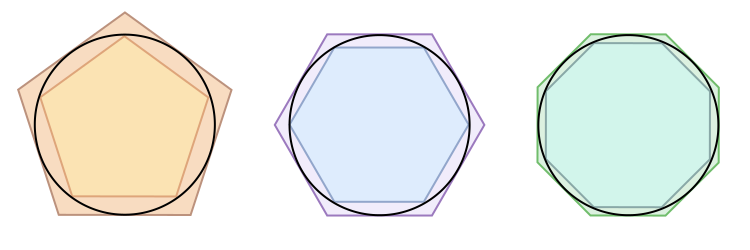

# archimedes-pi

Approximate pi with Archimedes' method using polygons.

## Table of Contents

-   [About](#about)
-   [Getting Started](#getting-started)
    -   [Prerequisites](#prerequisites)
    -   [Running](#running)
    -   [Initial setup](#initial-setup)
-   [Distributing](#distributing)
    -   [Installing](#installing)
    -   [Installing additional packages](#installing-additional-packages)
-   [Contributing](#contributing)
-   [Versioning](#versioning)
-   [Authors](#authors)
-   [License](#license)
-   [See also](#see-also)
-   [Acknowledgments](#acknowledgments)

## About

`3.14159265358979323846264338327950...`

The famous number &pi; pops up just about anywhere in math and physics.
It has intrigued mathematicians for thousands of years.

Yet, already around 250
BC the greek mathematician Archimedes developed a simple but ingenious algorithm
the approximate &pi;:



By starting off with a hexagon and successively doubling
the amount of edges, one can approach &pi; through the circumference of the
polygon:


From the figure above one can deduce this relation between s<sub>n</sub> and s<sub>2n</sub>:


## Getting Started

These instructions will get you a copy of the project up and running on your
local machine for development and testing purposes.

### Prerequisites

You will need python3 and pip3 installed on your machine. You can install it
from the official website https://www.python.org/.

### Running

To run the program, just type:

```bash
python3 main.py
```

### Initial setup

A step by step series of examples that tell you how to get a virtual python
environment running:

Clone the git repository

```bash
git clone https://github.com/umcconnell/archimedes-pi.git
```

And navigate into the folder

```bash
cd archimedes-pi/
```

Then create your virtual environment

```bash
python3 -m venv venv
```

Finally, start the virtual environment

```bash
source venv/bin/activate
```

To exit the virtual environment run

```bash
deactivate
```

Happy coding!

## Distributing

### Installing

To get started, activate the virtual environment:

```bash
source venv/bin/activate
```

Install the packages from `requirements.txt`:

```bash
pip3 install -r requirements.txt
```

### Installing additional packages

After activating the virtual environment, install your package(s)

```bash
pip3 install <package>
```

Then freeze your packages

```bash
pip3 freeze > requirements.txt
```

## Contributing

Please read [CONTRIBUTING.md](CONTRIBUTING.md) and
[CODE_OF_CONDUCT.md](CODE_OF_CONDUCT.md) for details on our code of conduct, and
the process for submitting pull requests to us.

## Versioning

We use [SemVer](http://semver.org/) for versioning. For the versions available,
see the [tags on this repository](https://github.com/umcconnell/archimedes-pi/tags).

## Authors

Ulysse McConnell - [umcconnell](https://github.com/umcconnell/)

See also the list of
[contributors](https://github.com/umcconnell/archimedes-pi/contributors)
who participated in this project.

## License

This project is licensed under the MIT License - see the
[LICENSE.md](LICENSE.md) file for details.

## See also

-   https://itech.fgcu.edu/faculty/clindsey/mhf4404/Archimedes/Archimedes.html
-   https://www.geogebra.org/m/xqXNW5TE
-   https://en.wikipedia.org/wiki/Pi

## Acknowledgments

-   https://introcs.cs.princeton.edu/java/data/pi-10million.txt : Verification
    file (shortened to 1 Million digits)
-   https://en.wikipedia.org/wiki/Pi : Information on the history of pi
